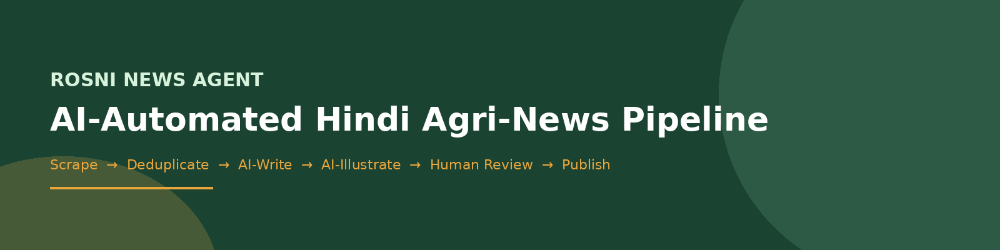
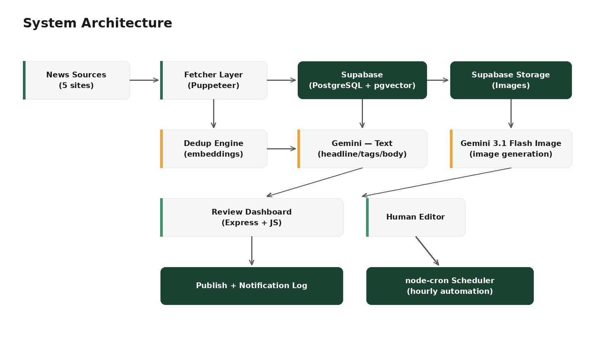
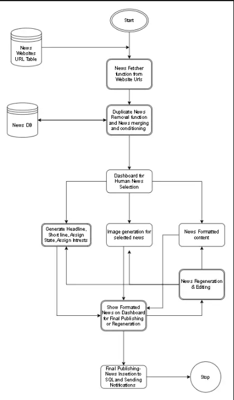
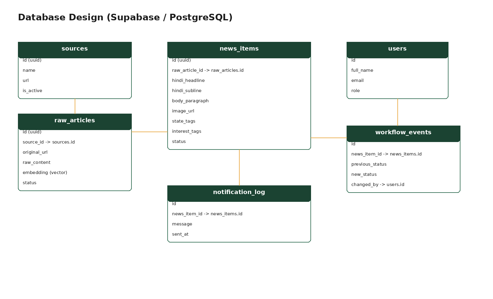
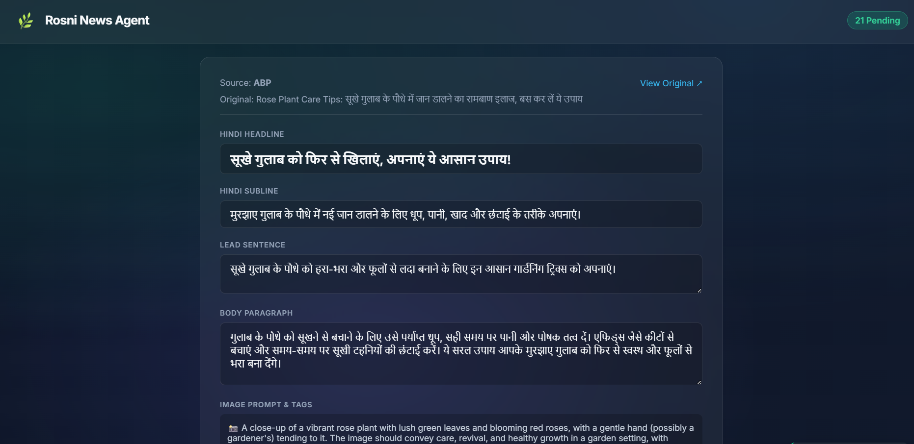
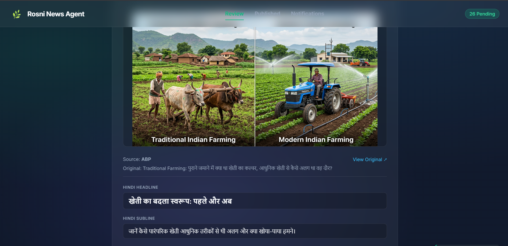

# Rosni News Agent



## Project Introduction

Welcome to the engineering documentation for the **Rosni News Agent**. This repository contains the source code, database design, and operational guidelines for the AI-powered automated agri-news pipeline developed for **Rosni Prime App**, built for Rosni Agri Pvt. Ltd.

## Features

- **Automated Multi-Source Ingestion:** Continuously scrapes 5 trusted Hindi agri-news sources (Krishijagran, Aajtak, ABP Live, ZeeBiz, KisanTak) without manual intervention.
- **AI-Generated Hindi Content:** Uses Google Gemini to generate farmer-friendly headlines, sub-lines, formatted body content, and topic tags — fully in Hindi.
- **AI-Generated Visuals:** Every news story receives a unique, AI-generated image relevant to its content, with on-demand regeneration.
- **Human-in-the-Loop Publishing:** No content goes live without editorial approval — every AI draft is reviewed, editable, and explicitly approved before publishing.
- **Self-Scheduling Pipeline:** Runs autonomously on an hourly cycle via an internal cron scheduler, requiring no manual triggering in normal operation.

## What is Rosni Prime?

Rosni Prime is a farmer-facing information platform by **Rosni Agri Pvt. Ltd.**, delivering timely agricultural news, market updates, and government scheme information to farmers across India. Previously curated manually, the platform required editors to scrape, write, and format every news card by hand.

## Why this News Agent?

To keep farmers informed at the pace real agricultural news moves — mandi price changes, scheme deadlines, weather alerts — the **Rosni News Agent** automates discovery, drafting, and illustration of news content, while keeping a human editor as the final gatekeeper before anything reaches farmers.

## Complete System Architecture



The system follows a modular pipeline architecture: a Node.js scraping layer, a Supabase-hosted PostgreSQL database (with pgvector for semantic deduplication), a Google Gemini–powered AI generation layer, an Express-based human review dashboard, and an automated scheduling layer.

## Workflow



The pipeline runs as a strict sequence: **Fetch → Deduplicate → AI-Generate Text → AI-Generate Image → Human Review → Publish → Notify.** Every stage writes its state to Supabase, so the pipeline can resume safely and nothing is processed twice.

## Technology Stack

- **Runtime:** Node.js (JavaScript)
- **Scraping:** Puppeteer (headless Chrome automation)
- **Backend / Dashboard Server:** Express.js
- **Frontend:** HTML5, Vanilla JavaScript, CSS3
- **Database:** Supabase (PostgreSQL 15+ with `pgvector` extension)
- **File Storage:** Supabase Storage
- **AI — Text Generation:** Google Gemini API
- **AI — Image Generation:** Google Gemini 3.1 Flash Image (Vertex AI Express Mode)
- **Scheduling:** node-cron
- **Environment Management:** dotenv

## AI Agent Pipeline

The pipeline processes each article through three sequential AI-assisted stages.

### 1. Ingestion & Deduplication Phase

`src/fetchers/*.js` scrape each of the 5 configured sources on a schedule, checking `original_url` to avoid re-processing known articles. Cleaned articles are embedded and compared using `pgvector` cosine similarity (`src/db/`) to detect and skip duplicate coverage of the same real-world event across sources.

### 2. Content Generation Phase

`src/ai/generate.js` sends each new article's cleaned text to Google Gemini, requesting a structured Hindi output: headline, sub-line, bold lead sentence, body paragraph, state tags, interest tags, and an image generation prompt.

### 3. Visual Generation Phase

`src/ai/imageGenerator.js` passes the AI-written image prompt to Gemini 3.1 Flash Image, receives the generated image, and uploads it directly to Supabase Storage — linking the resulting URL back to the corresponding news item.

## Database Design



Core tables: `sources`, `raw_articles` (with `embedding` for deduplication), `news_items` (the formatted, publishable card), `users`, `workflow_events`, and `notification_log` — all connected via foreign keys enforcing a mandatory human-approval workflow before publishing.

## Application Overview

The backend exposes internal routes powering the review dashboard.

- `GET /api/pending`: Fetches all news items awaiting human review.
- `POST /api/approve/:id`: Approves an item (with optional inline edits).
- `POST /api/reject/:id`: Rejects an item.
- `POST /api/regenerate-image/:id`: Triggers a fresh AI image for a specific item.
- `POST /api/publish/:id`: Moves an approved item to the final published state.

## Frontend Screenshots

### Review Dashboard



Editors see the AI-generated headline, sub-line, lead sentence, body, image, and tags for each pending article — all fields editable inline before approval.

## Sample Output

### Generated Image



Every published story receives a unique, AI-generated image matched to its content — no stock photography used.

## Installation

### Prerequisites

- Node.js 18+
- A Supabase account (free tier)
- Google Gemini API credentials

### 1. Clone & Install

```
git clone https://github.com/<your-username>/rosni-ai-news-agent.git
cd rosni-ai-news-agent
npm install
```

## Environment Variables

Copy the example environment file and fill in your real credentials.

```
cp .env.example .env
```

Ensure your `.env` contains:

```
SUPABASE_URL=your_supabase_project_url
SUPABASE_SERVICE_ROLE_KEY=your_supabase_service_role_key
GEMINI_API_KEY=your_gemini_api_key
GEMINI_IMAGE_API_KEY=your_gemini_express_mode_key
```

## Running the Project

### Database Setup

Run the schema and RLS policy files against your Supabase project via the SQL Editor:

```
src/db/schema.sql
src/db/rls_policies.sql
```

### Running the Stack

```
# Terminal 1: Start the Review Dashboard
npm run start:ui

# Terminal 2: Run the pipeline manually (or use the scheduler below)
npm run start:pipeline

# Optional — run continuously on an hourly schedule
npm run start:cron
```

Navigate to `http://localhost:3000` to access the Review Dashboard.

## Deployment

The system is designed for future deployment on a cloud-hosted Node.js environment (e.g., Render, Railway) with the scheduler (`cron.js`) running as a persistent background process, removing dependency on a local machine.

## Roadmap

- [x] Automated multi-source scraping
- [x] AI-generated Hindi content
- [x] AI-generated images
- [x] Human review & approval workflow
- [x] Hourly automated scheduling
- [ ] Verified semantic deduplication in production
- [ ] Real push/SMS notification delivery
- [ ] 24/7 cloud hosting

## Contributors

*Built for Rosni Agri Pvt. Ltd. Engineering Division.*